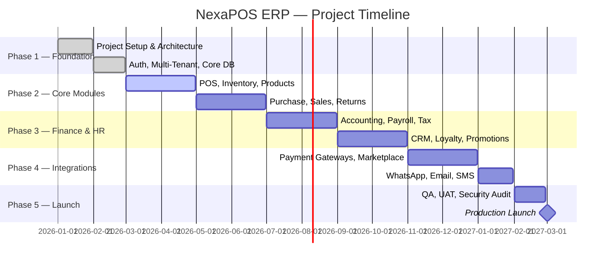

# 01 — PROJECT OVERVIEW
**SaaS ERP + POS Platform (Majoo-Like) — Powered by CodeIgniter 4**

---

## Table of Contents
1. [Executive Summary](#executive-summary)
2. [Vision](#vision)
3. [Mission](#mission)
4. [Product Goals](#product-goals)
5. [Business Objectives](#business-objectives)
6. [Success Metrics](#success-metrics)
7. [Stakeholders](#stakeholders)
8. [Technology Stack Summary](#technology-stack-summary)
9. [Project Timeline Overview](#project-timeline-overview)

---

## Executive Summary

**Product Name:** NexaPOS ERP  
**Version:** 1.0 (MVP)  
**Document Date:** June 2026  
**Document Status:** Approved  
**Classification:** Internal — Confidential

NexaPOS ERP is a cloud-native, multi-tenant Software-as-a-Service (SaaS) platform designed to empower small-to-medium enterprises (SMEs) and multi-branch retail/restaurant businesses with an integrated ERP and Point-of-Sale (POS) system. The platform mirrors and extends the capabilities of leading Indonesian SaaS POS solutions like Majoo, while being purpose-built on **CodeIgniter 4** (PHP 8.3+) for maximum developer productivity, extensibility, and performance.

The system unifies sales, inventory, purchasing, accounting, human resources, CRM, marketing, and analytics into a single, cohesive platform — accessible from web browsers and mobile devices. It supports multi-tenant architecture, enabling a single deployment to serve thousands of independent business tenants, each with their own isolated data, configurations, and subscription plans.

NexaPOS ERP addresses the critical operational pain points faced by Indonesian SMEs:
- Fragmented systems requiring multiple software subscriptions.
- Manual inventory tracking leading to shrinkage and stockouts.
- No real-time business visibility for owners and managers.
- Lack of integrated accounting reducing financial reporting accuracy.
- Disconnected loyalty and CRM systems limiting customer retention.

By delivering an all-in-one, affordable, and scalable platform, NexaPOS ERP enables business owners to **run smarter, sell faster, and grow further**.

---

## Vision

> **"To become the leading all-in-one cloud ERP + POS platform for Southeast Asian businesses — empowering every merchant, from street-side warung to multi-branch enterprise, with enterprise-grade tools."**

NexaPOS ERP envisions a future where every business — regardless of size or technical sophistication — has access to the same powerful operational tools previously available only to large corporations. We aim to democratize enterprise resource planning.

---

## Mission

> **"To deliver an intuitive, reliable, and scalable SaaS ERP + POS solution built on open-source technology — reducing operational complexity, increasing profitability, and enabling data-driven decision-making for every business we serve."**

Our mission is executed through:
- **Simplicity**: Making complex business operations simple and accessible.
- **Integration**: Unifying all business functions into one platform.
- **Reliability**: Delivering 99.9% uptime with enterprise-grade security.
- **Scalability**: Supporting businesses from 1 to 1,000+ locations.
- **Affordability**: Providing fair, transparent subscription pricing.

---

## Product Goals

### Goal 1: Unified Business Operations
Consolidate POS, inventory, purchasing, accounting, HR, and CRM into a single platform — eliminating the need for multiple disconnected tools.

### Goal 2: Real-Time Business Visibility
Provide business owners and managers with live dashboards and analytics, enabling immediate, data-driven decisions on sales performance, stock levels, and cash flow.

### Goal 3: Multi-Tenant SaaS Scalability
Architect the system to support thousands of simultaneous business tenants with complete data isolation, custom configurations, and independent subscription billing.

### Goal 4: Mobile-First Accessibility
Ensure all key workflows — including POS operations, approvals, inventory checks, and reporting — are fully accessible on smartphones and tablets without native app installation.

### Goal 5: Open Integration Ecosystem
Support integration with major Indonesian payment gateways (Midtrans, Xendit), QRIS, e-wallets (GoPay, OVO, DANA), marketplaces (Tokopedia, Shopee), and WhatsApp Business API.

### Goal 6: Compliance and Security
Ensure compliance with Indonesian tax regulations (PPN, PPh), PDPA data privacy requirements, and follow OWASP security standards.

---

## Business Objectives

| # | Objective | Target | Timeline |
|---|-----------|--------|----------|
| 1 | Acquire initial paying tenants post-launch | 500 tenants | Month 6 |
| 2 | Monthly Recurring Revenue (MRR) target | Rp 250,000,000 | Month 12 |
| 3 | Tenant churn rate below | 5% monthly | Month 6 |
| 4 | Average tenant NPS score above | 50 | Month 9 |
| 5 | System uptime SLA | 99.9% | Ongoing |
| 6 | API response time (P95) | < 300ms | Launch |
| 7 | Mobile responsiveness score | > 90 (Lighthouse) | Launch |
| 8 | Support ticket resolution time | < 24 hours | Month 3 |
| 9 | Expand to 3 Southeast Asian markets | Thailand, Malaysia | Month 18 |
| 10 | Achieve 10,000 active tenants | 10,000 tenants | Month 24 |

---

## Success Metrics

### Product Metrics
| Metric | Definition | Target |
|--------|------------|--------|
| Daily Active Users (DAU) | Unique users logging in per day | 60% of registered users |
| Feature Adoption Rate | % tenants using >5 modules | >70% |
| POS Transaction Speed | Avg. time per POS transaction | <30 seconds |
| Report Generation Time | Time to generate standard reports | <5 seconds |
| Mobile Session Ratio | % sessions from mobile devices | >40% |

### Business Metrics
| Metric | Definition | Target |
|--------|------------|--------|
| Customer Acquisition Cost (CAC) | Cost per new tenant acquired | <Rp 500,000 |
| Lifetime Value (LTV) | Average revenue per tenant lifetime | >Rp 5,000,000 |
| LTV:CAC Ratio | LTV divided by CAC | >10:1 |
| Monthly Churn Rate | Tenants canceling per month | <3% |
| Gross Revenue Retention | Revenue retained from existing tenants | >95% |

### Technical Metrics
| Metric | Definition | Target |
|--------|------------|--------|
| System Uptime | % availability per month | 99.9% |
| Mean Time to Recovery (MTTR) | Avg. recovery time from incidents | <1 hour |
| API Error Rate | % API calls returning errors | <0.1% |
| Database Query P99 | 99th percentile query time | <200ms |
| Automated Test Coverage | % code covered by tests | >80% |

---

## Stakeholders

### Internal Stakeholders

| Role | Name / Team | Responsibility |
|------|-------------|----------------|
| Product Owner | Product Team | Vision, prioritization, roadmap |
| Lead Architect | Engineering Team | System design, technology decisions |
| Backend Lead | Engineering Team | CI4 API, business logic, integrations |
| Frontend Lead | Engineering Team | Bootstrap 5 UI, DataTables, AJAX |
| Database Architect | Engineering Team | MySQL schema, performance, migrations |
| DevOps Engineer | Operations Team | Docker, CI/CD, infrastructure |
| QA Lead | QA Team | Test plans, execution, quality gates |
| UX Designer | Design Team | UI/UX wireframes, design system |
| Business Analyst | BA Team | Requirements, user stories, acceptance criteria |
| Finance Team | Internal | Subscription billing, pricing models |
| Customer Success | Support Team | Onboarding, training, retention |

### External Stakeholders

| Role | Description | Engagement |
|------|-------------|------------|
| Tenant Owners (SME) | Primary paying customers | Requirements, beta testing, feedback |
| Tenant Managers | Day-to-day platform operators | UAT, training, feature requests |
| Cashiers | End-users of the POS module | Usability testing |
| Accountants | Users of financial modules | Compliance review |
| Payment Gateway Partners | Midtrans, Xendit, QRIS | Integration, technical alignment |
| WhatsApp Business API | Meta/Gupshup | Notification integration |
| Marketplace Partners | Tokopedia, Shopee | E-commerce integration |
| Government/Regulators | DJP, BI | Tax compliance, QRIS compliance |
| Cloud Infrastructure | AWS/GCP/Alibaba | SLA, technical support |

---

## Technology Stack Summary

| Layer | Technology |
|-------|------------|
| **Backend Framework** | CodeIgniter 4 (PHP 8.3+) |
| **Database** | MySQL 8.0+ |
| **Cache / Session** | Redis 7+ |
| **Queue** | Redis Queue / Supervisor |
| **Frontend** | Bootstrap 5.3 + jQuery 3.7 + DataTables 2.x |
| **AJAX** | Axios / jQuery AJAX |
| **Authentication** | JWT (REST API) + CI4 Session (Web) |
| **Web Server** | Nginx 1.26+ |
| **Containerization** | Docker + Docker Compose |
| **CI/CD** | GitHub Actions |
| **Storage** | AWS S3 / MinIO (local) |
| **Email** | SMTP / SendGrid |
| **SMS** | Twilio / Zenziva |
| **WhatsApp** | Fonnte / Wablas API |
| **Payment** | Midtrans, Xendit, QRIS |
| **Monitoring** | Prometheus + Grafana |
| **Log Management** | ELK Stack (Elasticsearch, Logstash, Kibana) |

---

## Project Timeline Overview

---

*Document maintained by: Product Team | Last updated: June 2026 | Version: 1.0*
