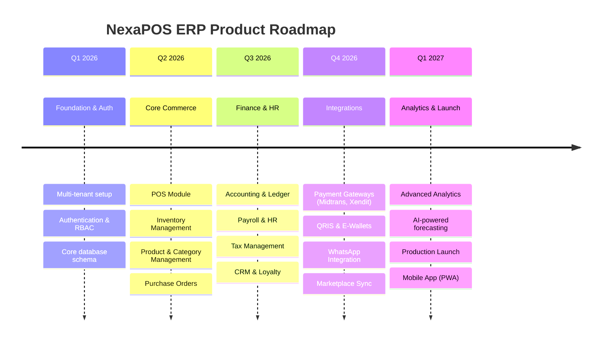

# 02 — PRODUCT REQUIREMENTS DOCUMENT (PRD)
**NexaPOS ERP — SaaS POS + ERP Platform**

---

## Table of Contents
1. [Product Overview](#product-overview)
2. [Problem Statement](#problem-statement)
3. [Solution Overview](#solution-overview)
4. [User Personas](#user-personas)
5. [User Roles](#user-roles)
6. [Features](#features)
7. [Functional Requirements](#functional-requirements)
8. [Non-Functional Requirements](#non-functional-requirements)
9. [User Stories](#user-stories)
10. [Acceptance Criteria](#acceptance-criteria)
11. [Product Roadmap](#product-roadmap)
12. [MVP Scope](#mvp-scope)
13. [Future Scope](#future-scope)

---

## Product Overview

**NexaPOS ERP** is a cloud-based, multi-tenant SaaS platform integrating Point-of-Sale (POS), Inventory Management, Purchase Management, Accounting, Human Resources, CRM, Marketing, and Analytics into a unified system. It is designed to serve Indonesian SMEs, retail chains, F&B businesses, service-based businesses, and multi-branch enterprises.

**Target Market:**
- Retail stores (fashion, electronics, groceries, pharmacies)
- F&B (restaurants, cafes, food courts)
- Service businesses (salons, workshops, clinics)
- Multi-branch enterprises (up to 1,000 branches)
- Wholesale distributors

**Business Model:** SaaS subscription with tiered plans (Starter, Professional, Enterprise).

---

## Problem Statement

### Key Pain Points Identified

| # | Pain Point | Affected Users | Business Impact |
|---|------------|----------------|-----------------|
| 1 | Using 3–5 disconnected tools for POS, inventory, accounting | SME Owners | High operational cost, data inconsistency |
| 2 | No real-time stock visibility across branches | Managers, Owners | Stockouts, overstock, shrinkage |
| 3 | Manual accounting and spreadsheet-based reporting | Accountants | Errors, delayed financial reports |
| 4 | No CRM or loyalty system — losing repeat customers | Owners, Marketing | Low customer retention rates |
| 5 | No QRIS / e-wallet integration at the POS | Cashiers | Lost sales, slow checkout |
| 6 | No mobile access for approvals and monitoring | Managers, Owners | Delayed decisions |
| 7 | No automated payroll or attendance tracking | HR Staff | Manual errors, compliance risk |
| 8 | No centralized multi-branch management | Owners | Inability to scale |
| 9 | Complex setup of existing enterprise software | All users | Low adoption, wasted licenses |
| 10 | No integrated WhatsApp/SMS notifications | Customers | Poor customer communication |

---

## Solution Overview

NexaPOS ERP solves these problems by providing:

1. **All-in-One Platform**: 55+ modules covering every business function.
2. **Cloud-Native Architecture**: Accessible from any browser, any device, anywhere.
3. **Multi-Tenant SaaS**: Complete data isolation per business, single deployment.
4. **Real-Time Dashboard**: Live KPIs, sales charts, stock alerts, and cash flow.
5. **Integrated POS**: Fast checkout with QRIS, e-wallet, card, and cash support.
6. **Smart Inventory**: Multi-warehouse, multi-branch, FIFO/LIFO costing, stock opname.
7. **Full Accounting**: Double-entry bookkeeping, P&L, balance sheet, cash flow.
8. **HR Suite**: Attendance, shift, payroll, leave management.
9. **CRM + Loyalty**: Customer profiles, purchase history, points, vouchers, membership.
10. **Omnichannel Integration**: Marketplace sync, WhatsApp notifications, payment gateways.

---

## User Personas

### Persona 1: Budi — SME Retail Owner
- **Age**: 38 | **Location**: Surabaya | **Business**: Electronics retail, 3 branches
- **Tech Savviness**: Medium
- **Goals**: Monitor sales across all branches, control stock, see profitability
- **Pain Points**: Uses Excel for inventory, WhatsApp for orders, no real accounting
- **Expectations**: Simple dashboard, mobile-friendly, affordable price

### Persona 2: Siti — Restaurant Manager
- **Age**: 32 | **Location**: Jakarta | **Business**: Family restaurant chain, 5 outlets
- **Tech Savviness**: Medium-High
- **Goals**: Manage cashiers, approve discounts, view daily sales report
- **Pain Points**: Cashier errors, no daily recap, manual attendance
- **Expectations**: Fast POS, cashier management, attendance tracking

### Persona 3: Andi — Cashier / POS Operator
- **Age**: 24 | **Location**: Bandung | **Business**: Fashion retail
- **Tech Savviness**: Medium
- **Goals**: Process transactions quickly, apply discounts, print receipts
- **Pain Points**: Slow POS, complex UI, connection dependency
- **Expectations**: Fast, simple POS interface, offline fallback

### Persona 4: Dewi — Accountant
- **Age**: 35 | **Location**: Jakarta | **Business**: Multi-branch pharmacy chain
- **Tech Savviness**: High
- **Goals**: Accurate financial reports, tax compliance, audit trails
- **Pain Points**: Manual journal entries, no automated tax calculation
- **Expectations**: Full double-entry accounting, tax reports, export to Excel/PDF

### Persona 5: Reza — Inventory Manager
- **Age**: 29 | **Location**: Medan | **Business**: Grocery wholesale
- **Tech Savviness**: Medium
- **Goals**: Track stock levels, manage suppliers, prevent stockouts
- **Pain Points**: No real-time stock visibility, manual stock counts
- **Expectations**: Stock alerts, barcode scanning, purchase order automation

---

## User Roles

| Role | Scope | Access Level | Key Capabilities |
|------|-------|--------------|------------------|
| **Super Admin** | Platform-wide | Full | Manage tenants, subscriptions, platform settings |
| **Tenant Owner** | Tenant-wide | Full (tenant) | All modules, reports, settings, billing |
| **Tenant Admin** | Tenant-wide | High | All modules except billing |
| **Manager** | Branch/All branches | Medium-High | Approve transactions, view reports, manage staff |
| **Cashier** | Branch (POS) | Low | POS transactions, basic sales |
| **Inventory Staff** | Branch/Warehouse | Medium | Stock management, receiving, transfers |
| **Accountant** | Tenant-wide | Medium-High | Accounting, financial reports, tax |
| **HR Staff** | Tenant-wide | Medium | Employee, attendance, payroll |
| **CRM Staff** | Tenant-wide | Medium | Customers, CRM, loyalty, promotions |
| **API User** | Tenant API | Scoped | Programmatic access via REST API |
| **Customer** | Self-service portal | Very Low | View loyalty points, vouchers, order history |

---

## Features

### Module Feature Map

| Module | Key Features |
|--------|-------------|
| **Authentication** | Email/password login, 2FA, role-based access, JWT, session management |
| **Multi-Tenant** | Tenant provisioning, isolation, custom domains, plan management |
| **Multi-Branch** | Branch creation, inter-branch transfers, branch-level reports |
| **POS** | Touch-friendly UI, barcode scan, split payment, hold orders, receipts |
| **Inventory** | Multi-warehouse, FIFO/LIFO, stock alerts, batch/expiry tracking |
| **Products** | SKU management, variants, bundles, pricing tiers, images |
| **Purchase Orders** | PO creation, approval workflow, goods receiving, supplier invoicing |
| **Sales Orders** | Quotation, sales order, delivery, invoice, payment |
| **Accounting** | Chart of accounts, journal entries, general ledger, reconciliation |
| **HR** | Employee profiles, departments, attendance, shifts, payroll |
| **CRM** | Customer profiles, interaction history, follow-ups, segmentation |
| **Loyalty** | Points earn/redeem, tiers, campaigns |
| **Promotions** | Discount rules, buy-X-get-Y, time-based, category-based |
| **Reporting** | 50+ pre-built reports, custom report builder, PDF/Excel export |
| **Analytics** | Revenue trend, product performance, customer analytics, forecasting |
| **Integrations** | Midtrans, Xendit, QRIS, GoPay, OVO, WhatsApp, Tokopedia, Shopee |
| **API** | RESTful JSON API, Swagger docs, API key management, rate limiting |
| **Notifications** | In-app, email, SMS, WhatsApp alerts for key business events |
| **Audit Log** | Immutable action logs for all user actions |
| **Subscriptions** | Tiered SaaS plans, auto-billing, usage limits, upgrade/downgrade |

---

## Functional Requirements

### FR-AUTH: Authentication & Authorization
| ID | Requirement |
|----|-------------|
| FR-AUTH-001 | System SHALL support email + password authentication |
| FR-AUTH-002 | System SHALL support Two-Factor Authentication (TOTP) |
| FR-AUTH-003 | System SHALL enforce Role-Based Access Control (RBAC) at module and field level |
| FR-AUTH-004 | System SHALL issue JWT tokens for REST API authentication |
| FR-AUTH-005 | System SHALL maintain secure session for web application (CI4 Session) |
| FR-AUTH-006 | System SHALL enforce password complexity rules and expiry |
| FR-AUTH-007 | System SHALL support "Remember Me" with secure cookie |
| FR-AUTH-008 | System SHALL lock accounts after 5 consecutive failed login attempts |
| FR-AUTH-009 | System SHALL provide password reset via email OTP |
| FR-AUTH-010 | System SHALL log all authentication events to audit log |

### FR-TENANT: Multi-Tenant Management
| ID | Requirement |
|----|-------------|
| FR-TENANT-001 | System SHALL isolate tenant data using tenant_id foreign key on all tenant-scoped tables |
| FR-TENANT-002 | System SHALL support tenant registration with email verification |
| FR-TENANT-003 | System SHALL allow tenants to configure business profile, logo, timezone, currency |
| FR-TENANT-004 | System SHALL enforce subscription plan limits (users, branches, products, transactions) |
| FR-TENANT-005 | System SHALL support custom subdomain per tenant (tenant.nexapos.id) |
| FR-TENANT-006 | System SHALL support tenant suspension and termination by Super Admin |

### FR-POS: Point of Sale
| ID | Requirement |
|----|-------------|
| FR-POS-001 | POS SHALL support product search by name, SKU, and barcode |
| FR-POS-002 | POS SHALL allow adding multiple items to cart with quantity adjustment |
| FR-POS-003 | POS SHALL support split payment (cash + e-wallet + card) |
| FR-POS-004 | POS SHALL apply promotions and discounts automatically |
| FR-POS-005 | POS SHALL support hold/resume orders |
| FR-POS-006 | POS SHALL generate printable and digital receipts |
| FR-POS-007 | POS SHALL support QRIS payment via QR code display |
| FR-POS-008 | POS SHALL deduct inventory automatically upon transaction completion |
| FR-POS-009 | POS SHALL support offline mode with sync upon reconnection |
| FR-POS-010 | POS SHALL support cashier session (open/close cash drawer) |
| FR-POS-011 | POS SHALL support customer lookup and loyalty point redemption |
| FR-POS-012 | POS SHALL support returns and refunds linked to original transaction |

### FR-INV: Inventory Management
| ID | Requirement |
|----|-------------|
| FR-INV-001 | System SHALL track stock levels per product per warehouse per branch |
| FR-INV-002 | System SHALL support FIFO and LIFO costing methods |
| FR-INV-003 | System SHALL generate low-stock alerts when stock falls below reorder point |
| FR-INV-004 | System SHALL support batch tracking and expiry date management |
| FR-INV-005 | System SHALL support stock transfer between branches/warehouses |
| FR-INV-006 | System SHALL support stock adjustment with reason codes |
| FR-INV-007 | System SHALL support stock opname (physical count) with variance reporting |
| FR-INV-008 | System SHALL maintain full stock movement history |

### FR-ACC: Accounting
| ID | Requirement |
|----|-------------|
| FR-ACC-001 | System SHALL support double-entry bookkeeping |
| FR-ACC-002 | System SHALL auto-generate journal entries from sales, purchases, and payments |
| FR-ACC-003 | System SHALL generate General Ledger, Trial Balance, P&L, Balance Sheet |
| FR-ACC-004 | System SHALL support tax calculation (PPN 11%, PPh) |
| FR-ACC-005 | System SHALL support bank reconciliation |
| FR-ACC-006 | System SHALL support multi-currency (base + foreign currencies) |
| FR-ACC-007 | System SHALL generate cash flow statement |

---

## Non-Functional Requirements

| Category | Requirement | Target |
|----------|-------------|--------|
| **Performance** | API response time P95 | < 300ms |
| **Performance** | Page load time (LCP) | < 2.5 seconds |
| **Performance** | POS transaction completion | < 5 seconds |
| **Scalability** | Concurrent users supported | 10,000+ |
| **Scalability** | Max tenants per deployment | 50,000 |
| **Availability** | System uptime SLA | 99.9% (< 8.7 hrs/year downtime) |
| **Security** | Authentication method | JWT + bcrypt password hashing |
| **Security** | Data in transit | TLS 1.3 |
| **Security** | Data at rest | AES-256 encryption for sensitive fields |
| **Security** | OWASP compliance | Top 10 mitigations implemented |
| **Usability** | Mobile responsiveness | Bootstrap 5 responsive grid |
| **Usability** | Lighthouse score | > 90 (Performance, Accessibility) |
| **Maintainability** | Code test coverage | > 80% |
| **Maintainability** | CI4 PSR-12 coding standard | Enforced via phpcs |
| **Compliance** | Indonesian tax compliance | PPN, PPh integration |
| **Compliance** | Data privacy | PDPA compliant |
| **Internationalization** | Languages supported | Indonesian (ID), English (EN) |
| **Backup** | Automated daily backups | Retained for 30 days |
| **Disaster Recovery** | RTO (Recovery Time Objective) | < 4 hours |
| **Disaster Recovery** | RPO (Recovery Point Objective) | < 1 hour |

---

## User Stories

### Epic: Authentication
| ID | As a... | I want to... | So that... |
|----|---------|--------------|------------|
| US-001 | Tenant Owner | Log in with my email and password | I can securely access my business dashboard |
| US-002 | Tenant Owner | Enable 2FA on my account | My account is protected from unauthorized access |
| US-003 | Manager | Reset my password via email | I can regain access if I forget it |
| US-004 | Super Admin | Lock a suspended tenant account | Unauthorized users cannot access inactive tenants |

### Epic: POS
| ID | As a... | I want to... | So that... |
|----|---------|--------------|------------|
| US-010 | Cashier | Search products by barcode scan | I can quickly add items to the cart |
| US-011 | Cashier | Apply a discount to a transaction | I can honor promotions and discounts |
| US-012 | Cashier | Accept QRIS payment | Customers can pay with any e-wallet |
| US-013 | Cashier | Hold an order and serve another customer | I can handle multiple customers efficiently |
| US-014 | Cashier | Print a receipt after payment | The customer has proof of purchase |
| US-015 | Manager | View all POS transactions for the day | I can monitor cashier performance |

### Epic: Inventory
| ID | As a... | I want to... | So that... |
|----|---------|--------------|------------|
| US-020 | Inventory Staff | View real-time stock levels per product | I know what needs to be reordered |
| US-021 | Inventory Staff | Receive goods against a purchase order | Stock is updated accurately |
| US-022 | Inventory Staff | Transfer stock between branches | I can balance inventory across locations |
| US-023 | Manager | Receive low-stock alerts | I can initiate reordering before stockout |
| US-024 | Inventory Staff | Conduct a stock opname | I can reconcile physical stock vs system |

### Epic: Accounting
| ID | As a... | I want to... | So that... |
|----|---------|--------------|------------|
| US-030 | Accountant | View the general ledger | I can audit all financial transactions |
| US-031 | Accountant | Generate a P&L statement | Management can see monthly profitability |
| US-032 | Accountant | Calculate PPN tax automatically | Tax filing is accurate and timely |
| US-033 | Accountant | Reconcile bank statements | Cash books match bank records |

### Epic: HR & Payroll
| ID | As a... | I want to... | So that... |
|----|---------|--------------|------------|
| US-040 | HR Staff | Record employee attendance daily | Payroll is calculated accurately |
| US-041 | HR Staff | Manage employee shift schedules | Branches are staffed optimally |
| US-042 | HR Staff | Run payroll for all employees | Salaries are paid correctly and on time |
| US-043 | Employee | View my payslip | I can verify my salary details |

---

## Acceptance Criteria

### AC-001: POS Transaction Completion
**Given** a cashier has added items to cart and selected a payment method  
**When** the cashier clicks "Complete Payment"  
**Then** the system SHALL:
- Deduct stock from the selected branch warehouse
- Create a sales transaction record
- Auto-generate a journal entry debit Cash / credit Revenue
- Issue loyalty points to the customer (if applicable)
- Print or display digital receipt
- Complete within 5 seconds

### AC-002: Low Stock Alert
**Given** a product's current stock falls below its defined reorder point  
**When** a sales transaction reduces stock past that threshold  
**Then** the system SHALL:
- Immediately create a low-stock alert record
- Send an in-app notification to the Manager and Inventory Staff
- Optionally send an email/WhatsApp alert based on notification settings

### AC-003: Multi-Tenant Data Isolation
**Given** two tenants (Tenant A and Tenant B) exist in the system  
**When** Tenant A's user queries any data  
**Then** the system SHALL:
- Only return data where `tenant_id` matches Tenant A's ID
- Return 403 Forbidden for any attempt to access Tenant B's data
- Log any cross-tenant access attempt in the security audit log

---

## Product Roadmap

---

## MVP Scope

The Minimum Viable Product (MVP) for NexaPOS ERP shall include:

| Module | In MVP | Notes |
|--------|--------|-------|
| Authentication & RBAC | ✅ Yes | Full implementation |
| Multi-Tenant Architecture | ✅ Yes | Core isolation and provisioning |
| Multi-Branch | ✅ Yes | Up to 5 branches per tenant |
| POS / Cashier | ✅ Yes | Full POS with cash + QRIS |
| Product Management | ✅ Yes | SKUs, variants, categories |
| Inventory Management | ✅ Yes | Stock tracking, alerts |
| Purchase Orders | ✅ Yes | PO + Goods Receiving |
| Supplier Management | ✅ Yes | |
| Customer Management | ✅ Yes | Basic CRM |
| Sales Transactions | ✅ Yes | |
| Basic Accounting | ✅ Yes | Journal, Ledger, P&L |
| Employee Management | ✅ Yes | Profiles, departments |
| Attendance | ✅ Yes | Clock-in/out |
| Basic Reporting | ✅ Yes | Sales, inventory, finance reports |
| Dashboard | ✅ Yes | KPI dashboard |
| Notification Center | ✅ Yes | In-app only |
| Audit Logs | ✅ Yes | |
| Subscription Billing | ✅ Yes | Starter plan only |
| CRM / Loyalty | ⚠️ Partial | Basic customer profiles |
| Payroll | ⚠️ Partial | Basic salary calculation |
| QRIS / Payment Gateway | ⚠️ Partial | QRIS only in MVP |
| WhatsApp Integration | ❌ No | Phase 2 |
| Marketplace Integration | ❌ No | Phase 3 |
| Advanced Analytics | ❌ No | Phase 3 |

---

## Future Scope

| Feature | Phase | Priority |
|---------|-------|----------|
| AI-powered demand forecasting | Phase 3 | High |
| Native mobile apps (iOS/Android) | Phase 3 | High |
| WhatsApp Business API integration | Phase 2 | High |
| Marketplace sync (Tokopedia, Shopee) | Phase 3 | Medium |
| E-commerce storefront | Phase 4 | Medium |
| Advanced CRM with automation | Phase 2 | Medium |
| Multi-currency support | Phase 2 | Medium |
| Franchisor management module | Phase 4 | Medium |
| Biometric attendance integration | Phase 3 | Low |
| Custom report builder (drag & drop) | Phase 3 | Medium |
| White-label reseller program | Phase 4 | High |
| Offline-first PWA | Phase 3 | High |
| Voice command POS | Phase 4 | Low |
| Automated tax filing (e-SPT) | Phase 3 | High |

---

*Document maintained by: Product Team | Last updated: June 2026 | Version: 1.0*
