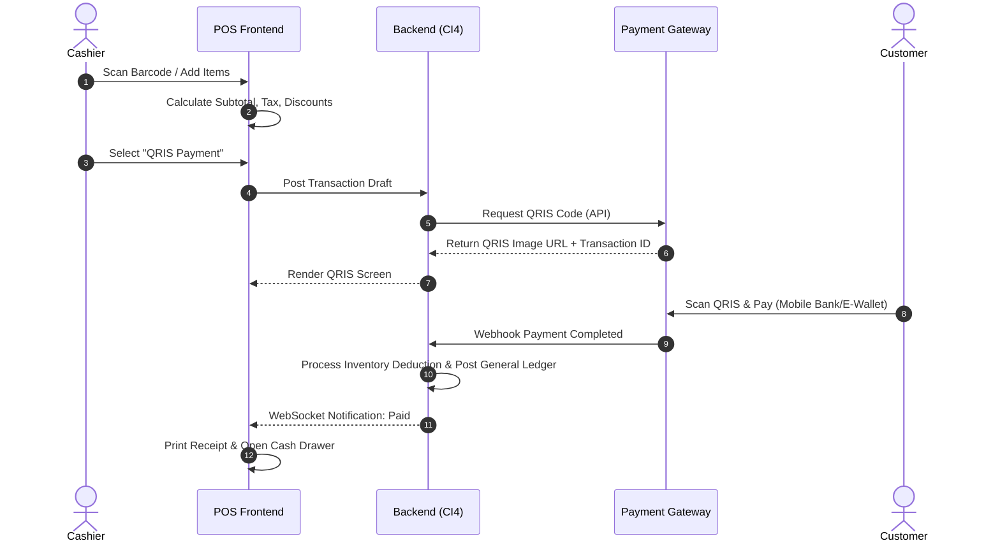

# 05 — USE CASE SPECIFICATION
**NexaPOS ERP — SaaS POS + ERP Platform**

---

## Table of Contents
1. [Actors & Roles](#1-actors--roles)
2. [Use Case Directory](#2-use-case-directory)
3. [Detailed Use Case Specifications](#3-detailed-use-case-specifications)
   - [UC-01: Process POS Sale (QRIS)](#uc-01-process-pos-sale-qris)
   - [UC-02: Reconcile Physical Stock (Stock Opname)](#uc-02-reconcile-physical-stock-stock-opname)
   - [UC-03: Process Supplier Invoice & Goods Receipt](#uc-03-process-supplier-invoice--goods-receipt)
   - [UC-04: Auto-Generate Financial Statements](#uc-04-auto-generate-financial-statements)

---

## 1. Actors & Roles

- **Cashier (POS Operator):** Interacts with the cash register, scans items, handles payments, prints receipts.
- **Inventory Staff:** Manages warehouse inventory, performs adjustments, counts physical stock.
- **Accountant:** Configures Chart of Accounts, reviews journal entries, reconciles banks, generates reports.
- **Tenant Owner:** Supervises all branches, accesses dashboards, manages subscriptions.
- **System Payment Gateway (External Actor):** Processes digital transaction authorization and settlement.
- **System ERP Engine (Internal Actor):** Automatically processes backend data (COGS, general ledger postings).

---

## 2. Use Case Directory

| Use Case ID | Name | Primary Actor | Description |
|-------------|------|---------------|-------------|
| **UC-01** | Process POS Sale (QRIS) | Cashier | Scans products, builds cart, generates QRIS, verifies payment. |
| **UC-02** | Reconcile Physical Stock | Inventory Staff | Compares system inventory against physical inventory. |
| **UC-03** | Process Goods Receipt | Inventory Staff | Receives physical goods and reconciles them against a PO. |
| **UC-04** | Auto-Generate Statements | Accountant | Generates Balance Sheets and profit & loss statements. |

---

## 3. Detailed Use Case Specifications

### UC-01: Process POS Sale (QRIS)

- **Description:** Cashier scans products, builds a cart, generates a QRIS code, and verifies successful payment completion.
- **Actors:** Cashier (Primary), Payment Gateway System (External), System ERP Engine (Internal).
- **Preconditions:**
  - Cashier has an active POS terminal session open.
  - Inventory is populated with items containing prices and barcode configurations.
  - The POS device is connected to the internet.

#### Use Case Flow details:
1. **Main Flow (UC-01):**
   1. Cashier scans a product barcode or searches and selects the product manually on the UI.
   2. The system adds the product to the active cart and calculates totals, discounts, and tax (PPN).
   3. Cashier initiates checkout and selects "QRIS" as the payment method.
   4. The system posts a draft sale transaction to the backend API.
   5. The backend requests dynamic QRIS generation from the Payment Gateway (Xendit/Midtrans).
   6. The gateway returns the QRIS graphic payload, and the POS UI renders it to the customer.
   7. The customer scans the QRIS code with their mobile banking/e-wallet app and authorizes payment.
   8. The payment gateway returns an instant webhook notification to the system backend confirming settlement.
   9. The backend processes inventory deductions, posts automated ledger journals, and sets the transaction status to "Completed".
   10. The POS frontend receives the success webhook, displays the payment confirmation screen, and triggers thermal receipt printing.

2. **Alternative Flow (Offline Mode):**
   - At step 3, if the POS frontend detects internet loss:
     1. The system alerts the cashier: "Internet offline. Switched to Offline POS. QRIS unavailable."
     2. Cashier switches payment method to Cash.
     3. POS stores transaction draft locally in IndexDB.
     4. POS prints an offline receipt queue number.
     5. Once connection is restored, POS auto-syncs the queued IndexDB transactions to the backend database.

3. **Exception Flow (Payment Declined / Expired):**
   - At step 7, if the customer fails to pay within 120 seconds (expiry timeout):
     1. The payment gateway triggers an expiry callback to the system backend.
     2. The POS UI alerts the cashier: "Payment Timeout. QRIS expired."
     3. Cashier cancels the transaction or selects an alternate payment method (e.g. cash, card).

---

### UC-02: Reconcile Physical Stock (Stock Opname)

- **Description:** Inventory staff reviews system stock levels, physically counts items, and records variances to adjust the system inventory ledger.
- **Actors:** Inventory Staff (Primary), System ERP Engine (Internal).
- **Preconditions:**
  - Inventory Staff is logged in and assigned to the specific warehouse.
  - No active stock transfers are in transit for the warehouse during the opname.

#### Use Case Flow details:
1. **Main Flow (UC-02):**
   1. Staff creates a new "Stock Opname" document for a warehouse location.
   2. The system locks the inventory adjustments UI for the selected products to prevent double-adjustments.
   3. Staff prints the stock count worksheet (showing product names, SKUs, and empty count boxes).
   4. Staff performs physical counts and inputs the actual quantities found into the system opname interface.
   5. The system calculates the variance (System Quantity - Physical Quantity).
   6. Staff submits the opname document.
   7. System ERP Engine updates the inventory balances, adjusts average item costs, and records automated general ledger entries for stock adjustments.
   8. The product lock is removed.

2. **Alternative Flow (No Variance):**
   - At step 5, if all physical counts match the system quantity:
     1. No variance adjustments are generated.
     2. The document is closed as "Matched".

3. **Exception Flow (High Variance Escalation):**
   - At step 5, if any variance exceeds 10% of total stock value or is worth more than Rp 5,000,000:
     1. The system blocks instant submission.
     2. The document status is updated to "Pending Manager Approval".
     3. An alert is sent to the Manager dashboard.
     4. System stock remains unchanged until approval is granted.

---

### UC-03: Process Supplier Invoice & Goods Receipt

- **Description:** Inventory staff records receiving physical goods from suppliers, verifying actual quantities against the Purchase Order.
- **Actors:** Inventory Staff (Primary).
- **Preconditions:**
  - A Purchase Order has been approved and is in "Sent to Supplier" status.

#### Use Case Flow details:
1. **Main Flow (UC-03):**
   1. Staff selects the matching Purchase Order number on the Goods Receipt UI.
   2. Staff scans/inspects received items and inputs actual quantities and batch/expiry data.
   3. Staff flags any items that are broken, incorrect, or missing.
   4. The system validates received counts against PO counts.
   5. Staff clicks "Complete Goods Receipt".
   6. The system updates stock levels, records average item costs, and updates PO status to "Partially Received" or "Fully Received".
   7. The system creates a pending purchase invoice entry for accounting verification.

2. **Exception Flow (Quantity Over-delivery):**
   - At step 4, if the received quantity exceeds the PO quantity:
     1. The system alerts the user of the over-delivery.
     2. User must select whether to accept the surplus (which generates an auto-adjusted PO update requiring manager approval) or reject the surplus (updating the delivery status to only match original quantities).

---

### UC-04: Auto-Generate Financial Statements

- **Description:** Accountant runs calculations to generate General Ledgers, Profit & Loss, and Balance Sheets.
- **Actors:** Accountant (Primary), System ERP Engine (Internal).
- **Preconditions:**
  - All journal entries for the target month have been posted and reconciled.

#### Use Case Flow details:
1. **Main Flow (UC-04):**
   1. Accountant navigates to the Financial Reports module and selects the target report type (e.g. Profit & Loss).
   2. Accountant defines filters: date range, branch, and comparison columns.
   3. Accountant clicks "Generate Report".
   4. The system ERP Engine queries the general ledger tables, aggregates balances by Chart of Accounts hierarchy, and renders the report on-screen.
   5. Accountant verifies data and exports the report to PDF or Excel.

---

*Document maintained by: Tech Architecture Team | Last updated: June 2026 | Version: 1.0*
