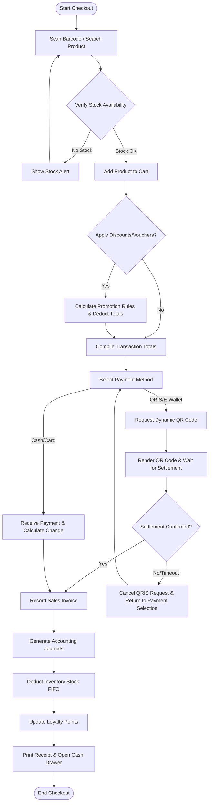
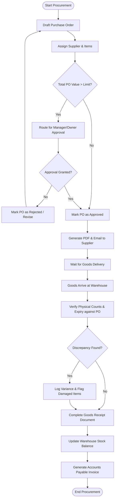
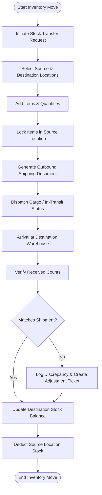
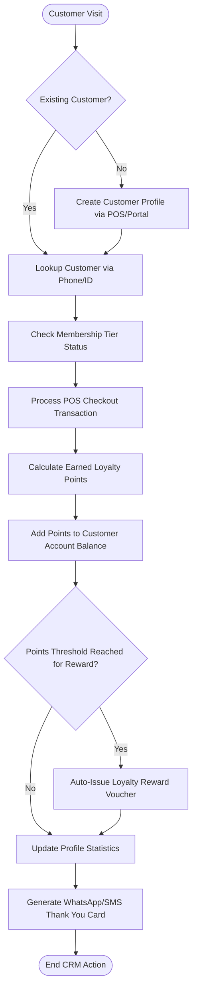
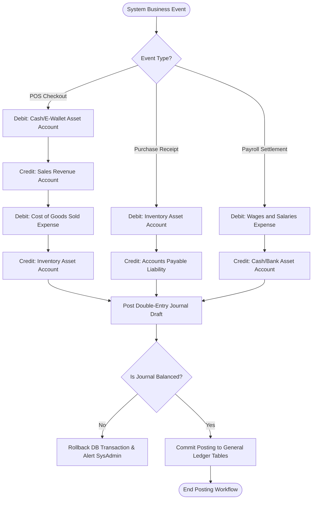
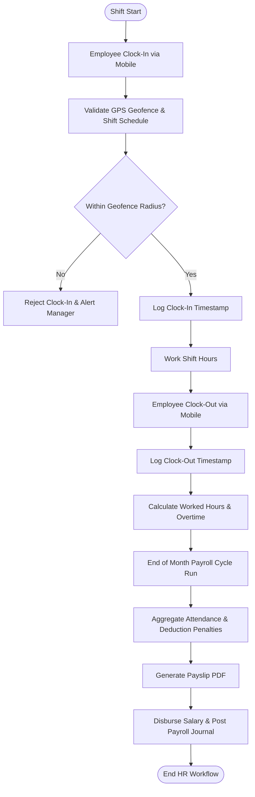

# 07 — WORKFLOW DOCUMENTATION
**NexaPOS ERP — SaaS POS + ERP Platform**

---

## Table of Contents
1. [Sales and POS Checkout Flow](#1-sales-and-pos-checkout-flow)
2. [Purchase Order and Receiving Flow](#2-purchase-order-and-receiving-flow)
3. [Inventory Transfer and Adjustment Flow](#3-inventory-transfer-and-adjustment-flow)
4. [CRM and Loyalty Campaign Flow](#4-crm-and-loyalty-campaign-flow)
5. [Accounting Posting Flow](#5-accounting-posting-flow)
6. [HR Attendance and Payroll Flow](#6-hr-attendance-and-payroll-flow)
7. [SaaS Tenant Onboarding & Subscription Flow](#7-saas-tenant-onboarding--subscription-flow)

---

## 1. Sales and POS Checkout Flow

This workflow illustrates how a cashier handles sales transactions on the POS screen, manages cash/e-wallet payments, and syncs transaction records.



---

## 2. Purchase Order and Receiving Flow

This workflow outlines how purchase requests are routed for approvals, sent to suppliers, and checked in at the warehouse.



---

## 3. Inventory Transfer and Adjustment Flow

This workflow tracks the stock movements between internal branch warehouses and the validation of inventory levels during audits.



---

## 4. CRM and Loyalty Campaign Flow

This workflow defines how customers are registered, segmented, and rewarded with points and vouchers based on sales activity.



---

## 5. Accounting Posting Flow

This workflow details the automated trigger points that generate ledger accounts and double-entry book records from commercial activity.



---

## 6. HR Attendance and Payroll Flow

This workflow demonstrates how employee timesheets are recorded, checked against shifts, and processed to compile salaries.



---

## 7. SaaS Tenant Onboarding & Subscription Flow

This workflow documents the lifecycle of a tenant, from initial system provisioning through billing and plan tier gates.

```mermaid
flowchart TD
    A([New Sign-Up Request]) --> B[Create Tenant Workspace Database Record]
    B --> C[Setup Isolated Schema & Seed Standard Master Data]
    C --> D[Generate Default Tenant Owner Admin User]
    D --> E[Assign Trial Period Plan (14 Days)]
    E --> F[Send Welcome Email with Setup Tutorial]
    F --> G[Run Business POS & Inventory Operations]
    G --> H{Trial Period Near Expiration?}
    H -- Yes --> I[Display Upgrade Notification & Email Alerts]
    H -- No --> G
    I --> J{Tenant Pays Subscription Invoice?}
    J -- Yes --> K[Activate Paid Tier Plan & Update Expiry Date]
    K --> G
    J -- No --> L{Past Grace Period?}
    L -- Yes --> M[Suspend Tenant Account / Deactivate POS]
    L -- No --> G
    M --> N([End Lifecycle])
```

---

*Document maintained by: Tech Architecture Team | Last updated: June 2026 | Version: 1.0*
