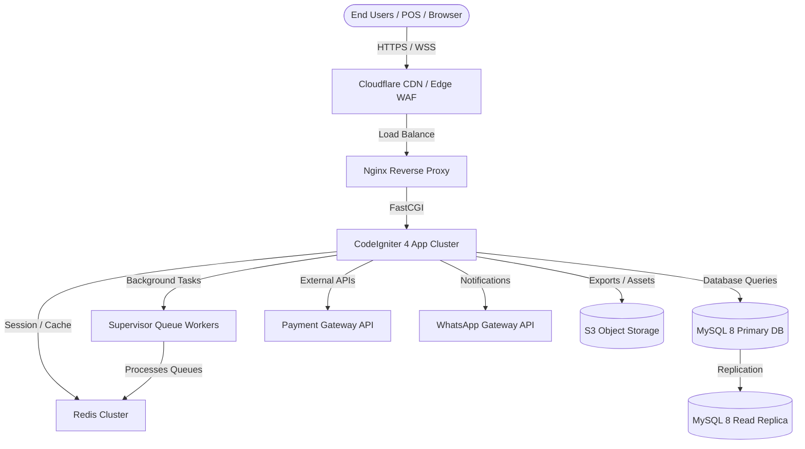
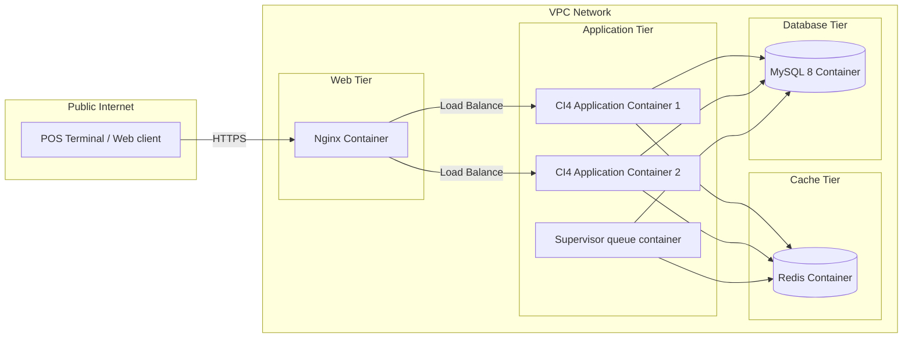

# 08 — SYSTEM ARCHITECTURE
**NexaPOS ERP — SaaS POS + ERP Platform**

---

## Table of Contents
1. [High-Level Architecture](#1-high-level-architecture)
2. [Component Architecture](#2-component-architecture)
3. [Deployment Architecture](#3-deployment-architecture)
4. [CodeIgniter 4 Layer Structure](#4-codeigniter-4-layer-structure)

---

## 1. High-Level Architecture

NexaPOS ERP uses a multi-tenant SaaS architecture utilizing a single application code base and logical data isolation (shared database, tenant ID partitioning) optimized for cloud scaling.



---

## 2. Component Architecture

The platform separates responsibilities between presentation, business logic, storage, and asynchronous background pipelines:

- **Presentation Layer (Sleek Modern Web):** Powered by Bootstrap 5, jQuery, DataTables, and Axios for AJAX operations. It communicates with the backend via traditional views and REST APIs.
- **API Access Layer (RESTful API Gateway):** Utilizes CodeIgniter 4 Filters for JWT-based auth checks, CORS control, and API request rate-limiting.
- **Application Logic Layer (CI4 App Core):** Custom CI4 Controllers execute operations by interacting with the Business Domain Services.
- **Domain Services Layer:** Dedicated Service classes isolate complex transactional operations (e.g. `AccountingService`, `InventoryService`, `SaaSPlanService`).
- **Data Caching & Queue Layer (Redis):** Manages user session state, caches database query structures, and queues long-running tasks.
- **Data Storage Layer (MySQL 8):** Houses the relational tables. All tenant database operations are intercepted by CI4 Models using Query Filters to append `tenant_id` clauses automatically.

---

## 3. Deployment Architecture

For high availability and seamless developer operations, NexaPOS ERP is deployed via Docker containers orchestrated in a staging/production network layout.



---

## 4. CodeIgniter 4 Layer Structure

NexaPOS ERP implements a custom modular structure inside the CodeIgniter 4 codebase to cleanly isolate features and simplify updates.

### Modular Namespace Design
All business domains reside within the `app/Modules/` directory:

```
app/
├── Config/             # System configuration files
├── Filters/            # Authentication, CORS, Tenant filters
├── Helpers/            # Helper utilities (currency, audit log helpers)
└── Modules/            # Core business modules
    ├── Authentication/
    │   ├── Controllers/
    │   ├── Models/
    │   ├── Views/
    │   └── Services/
    ├── Inventory/
    │   ├── Controllers/
    │   ├── Models/
    │   ├── Views/
    │   └── Services/
    ├── POS/
    │   ├── Controllers/
    │   ├── Models/
    │   ├── Views/
    │   └── Services/
    └── Financials/
        ├── Controllers/
        ├── Models/
        ├── Views/
        └── Services/
```

### Module Component Flow
When a request is initiated:
1. **Routing and Filters:** The request is mapped to a module controller and intercepted by `app/Filters/JWTAuthFilter.php` (API) or `app/Filters/SessionAuthFilter.php` (Web).
2. **Tenant Middleware:** `app/Filters/TenantFilter.php` checks the incoming host (subdomain) or headers to determine the active `Tenant ID` and binds it to the application state.
3. **Controller Handling:** The Controller (e.g. `POSController`) parses inputs, runs validations, and passes payloads to the Module Service class (`POSService`).
4. **Service Transaction Handling:** The Service handles database transactions, executing multiple model updates within unit of work blocks (`$db->transStart()`, `$db->transComplete()`).
5. **Model Operations:** Models (extending a custom `BaseTenantModel`) append the `tenant_id` query parameter automatically on all selects, inserts, updates, and deletes.

---

*Document maintained by: Tech Architecture Team | Last updated: June 2026 | Version: 1.0*
